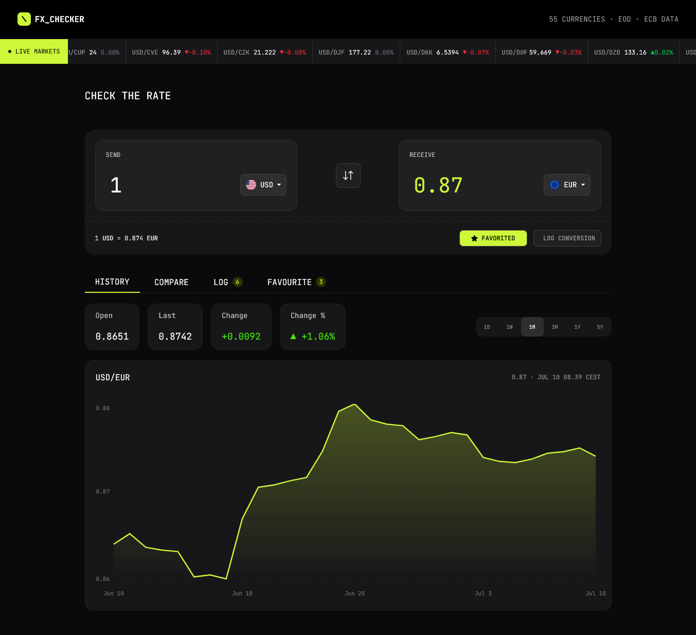

# Frontend Mentor - FX Checker solution

This is a solution to the [FX Checker challenge on Frontend Mentor](https://www.frontendmentor.io/challenges/foreign-exchange-currency-converter). Frontend Mentor challenges help you improve your coding skills by building realistic projects.

## Table of contents

  - [Overview](#overview)
  - [The challenge](#the-challenge)
  - [Screenshot](#screenshot)
  - [Links](#links)
  - [My process](#my-process)
  - [Built with](#built-with)
  - [What I learned](#what-i-learned)
  - [Continued development](#continued-development)
  - [AI Collaboration](#ai-collaboration)
  - [Author](#author)

## Overview

### The challenge

Your users should be able to:

#### Converter

- Enter an amount to send and see it convert in real time as they type
- Pick the "send" and "receive" currencies from a searchable currency picker
- See the live exchange rate for the active pair (for example, `1 USD = 0.8530 EUR`)
- Swap the send and receive currencies with the swap button
- Favorite the active pair, and log a conversion to their history

#### Currency picker

- Search the full list of available currencies by code or name
- See currencies grouped into "Popular" and "Other currencies", each row showing the flag, code, and name
- See a check against the currency that's currently selected

#### Live markets ticker

- See a ticker of currency pairs, each with its current rate and 24-hour change (up or down)

#### Rate history

- View a line and area chart of the active pair's rate over time
- Switch the chart range between 1D, 1W, 1M, 3M, 1Y, and 5Y
- See the open, last, absolute change, and percentage change for the selected range

#### Compare

- See their send amount converted into a range of other currencies at once, each with its reference rate
- Pin or unpin any comparison row to their favorites

#### Favorites

- See their pinned pairs, each with its live rate and 24-hour change
- Load a pinned pair back into the converter by selecting its row
- Unpin a pair they no longer want to track

#### Conversion log

- See a log of conversions they've made, each showing the relative time, the pair, and the send and receive amounts
- Clear the whole log
- Delete an individual entry

#### UI & accessibility

- View the optimal layout for the interface depending on their device's screen size
- See hover and focus states for all interactive elements on the page
- Navigate the entire app using only their keyboard
- Persist the active pair in the URL so a conversion can be shared

### Screenshot

### Links

- Solution URL: [Add solution URL here](https://www.frontendmentor.io/solutions/accessible-real-time-currency-converter-with-react-tailwind-css-axio-NHWVPg7PS5)
- Live Site URL: [Add live site URL here](https://currency-converter-app-flame-kappa.vercel.app/)

## My process

### Built with

- React
- Vite
- Tailwind CSS
- Axios
- Recharts
- React Router
- Frankfurter API
- Day.js
- Local Storage
- Semantic HTML5
- Mobile-first workflow
- Responsive design
- Accessibility (keyboard navigation & ARIA)

### What I learned

This project helped me strengthen my React skills by managing complex state, handling asynchronous data fetching, and building reusable components. I also gained hands-on experience with Recharts, learning how to create interactive historical exchange rate charts that update based on user-selected time periods. Additionally, I improved my understanding of accessibility by implementing keyboard navigation and focus management, and learned how to combine static currency metadata with live API data to create a richer user experience.

### Continued development

In future projects, I'd like to further improve my accessibility skills, optimize performance, and explore more advanced data visualization techniques. I also want to deepen my understanding of state management patterns and continue building applications with a strong focus on usability and maintainability.

### AI Collaboration

I used ChatGPT throughout the project for brainstorming ideas, debugging issues, explaining concepts, and generating boilerplate code. It was especially helpful for speeding up repetitive tasks and suggesting different implementation approaches.

While the generated code was often a good starting point, it didn't always fully capture my specific requirements. In those cases, I iterated on its suggestions, refined the prompts, and adapted the code to arrive at a solution that best fit the project's needs.

## Author

- Website - [Anthony divine](https://currency-converter-app-flame-kappa.vercel.app/)
- Frontend Mentor - [@yourusername](https://www.frontendmentor.io/profile/Anthonydivine555)
- Twitter - [@yourusername](https://www.twitter.com/tony_d555)
